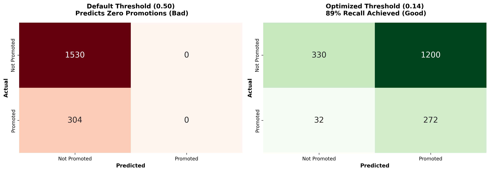
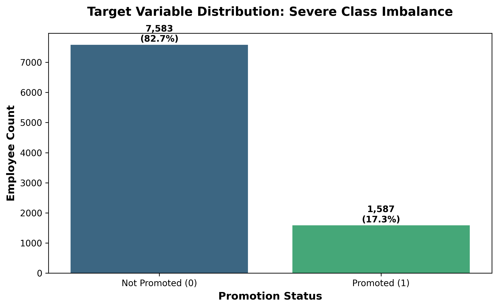

# Predicting Employee Promotions: Diagnosing Broken Merit Systems

**A logistic regression analysis revealing that 98.8% of promotion decisions are disconnected from measurable performance metrics.**

[](https://www.python.org/)
[](https://jupyter.org/)
[](https://streamlit.io/)

---

## Project Overview

This capstone project builds an interpretable logistic regression model to audit promotion processes in organizations. Rather than creating a black-box prediction system, the analysis serves as a **diagnostic tool** that exposes disconnects between stated merit criteria and actual promotion outcomes.

### Research Question
*Can logistic regression identify gaps between stated merit criteria and actual promotion decisions, enabling process standardization?*

**Key Finding**: The model achieved only **1.2% pseudo R²** — not a failure, but evidence that 98.8% of promotions are driven by factors outside documented performance metrics.

---

## Key Findings

### 1. The Merit Paradox
Performance metrics show **negative coefficients** in the model:
- Higher performance ratings → *Lower* promotion probability (-0.0159)
- Greater KPI achievement → *Lower* promotion probability (-0.0055)  
- More projects delivered → *Lower* promotion probability (-0.0049)

**Translation**: The current process doesn't just ignore merit — it actively penalizes it.

### 2. Process Dysfunction Quantified
**Pseudo R² = 0.012** means only 1.2% of promotions are explained by merit variables.

**The other 98.8%?** Unmeasured factors such as:
- Politics and favoritism
- Network effects (who you know)
- Proximity to decision-makers
- Unconscious bias

### 3. Solving the Accuracy Paradox



**The Problem**: At the default 0.50 threshold, the model predicts **zero promotions** due to class imbalance (17% promoted vs 83% not promoted). This yields 83% accuracy but 0% recall — catastrophic for talent identification.

**The Solution**: Optimized threshold (0.14) using precision-recall curve analysis:
- ✅ **89% recall** — catches 9 out of 10 promotable employees
- ✅ **19% precision** — acceptable trade-off for talent safety net
- ✅ **F2 score = 0.51** — prioritizes minimizing false negatives

---

## 📊 Technical Approach

### Methodology
- **Algorithm**: Statsmodels Logit (interpretable coefficients for audit trail)
- **Data**: 9,170 employees across 8 departments, 11 merit-based features
- **Validation**: 
  - Variance Inflation Factor (VIF) analysis for multicollinearity
  - Cook's Distance for influential observations
  - Hosmer-Lemeshow test for model fit
- **Optimization**: Precision-recall curve for threshold tuning

### Feature Engineering Decisions

**Excluded Variables** (circular logic / multicollinearity):
- `salary`, `kpis_count` — Proxies for role_level (VIF > 10)
- `years_in_company` — Redundant with years_in_role (VIF = 7.9)

**Retained Features** (11 variables):
- Role level, education level, tenure in role
- Performance rating, peer review score, awards
- KPI achievement %, training completed, certifications
- Mentorship participation, projects delivered

### Class Imbalance Strategy



**Challenge**: 82.7% not promoted vs 17.3% promoted

**Solution**:
1. Used precision-recall curve (not ROC) for threshold optimization
2. Prioritized F2 score over F1 (penalizes false negatives 2x)
3. Set recall target at 85%+ (talent safety net requirement)

---

## Business Application: 9-Box Talent Framework

The model outputs **promotion probability scores** that map to a 9-box grid:

| | **Low Performance** | **Moderate Performance** | **High Performance** |
|---|---|---|---|
| **High Potential** | Emerging Talent (106) | Development Ready (566) | **Stars** (1,621) |
| **Moderate Potential** | At Risk (503) | Solid Performers (1,599) | Core Contributors (2,482) |
| **Low Potential** | Underperformers (749) | Limited Growth (1,003) | Technical Experts (541) |

**Use Cases**:
- Talent review calibration sessions
- Succession planning prioritization  
- Bias audit compliance (NYC Local Law 144)
- Quarterly process drift monitoring

---

## Tech Stack

**Core Libraries**:
- `pandas`, `numpy` — Data manipulation
- `matplotlib`, `seaborn` — Visualization
- `statsmodels` — Logistic regression modeling
- `scikit-learn` — Model evaluation & validation
- `scipy` — Statistical testing

**Deployment**:
- `streamlit` — Interactive 9-box dashboard
- `jupyter` — Technical analysis documentation

---

## Repository Structure
```
capstone/
├── data/                    # Dataset files
├── notebooks/               # Full technical analysis
├── visualizations/          # Key plots for README
├── app/                     # Interactive dashboard (in development)
└── README.md
```

*Note: Streamlit dashboard coming soon*
---

## Quick Start

### View the Analysis
```bash
# Clone repository
git clone https://github.com/GitGamp/capstone.git
cd capstone-portfolio

# Install dependencies
pip install -r requirements.txt

# Launch Jupyter notebook
jupyter notebook notebooks/analysis.ipynb
```

### Run the Streamlit App
```bash
# From project root
streamlit run app/streamlit_app.py
```

**Live Demo**: [🔗 9-Box Talent Dashboard](https://YOUR-APP.streamlit.app) *(coming soon)*

---

## Model Performance Metrics

| Metric | Value | Interpretation |
|--------|-------|----------------|
| **Pseudo R²** | 0.012 | Low explanatory power = process dysfunction |
| **Recall** | 89% | Catches 9/10 promotable employees |
| **Precision** | 19% | Acceptable for talent safety net |
| **F2 Score** | 0.51 | Balanced metric favoring recall |
| **Accuracy** | 33% | Intentionally sacrificed for recall |

---

## Academic Context

**Program**: Master of Science in Data Analytics  
**Specialization**: Decision Process Engineering  
**Institution**: Western Governors University  
**Completion**: February 2025

**Project Motivation**: As a PHR-certified HR professional transitioning into People Analytics, this project demonstrates:
1. Root cause analysis over predictive accuracy
2. Stakeholder translation (technical → business impact)
3. Regulatory compliance awareness (bias audits)
4. Process engineering mindset

---

## Contact

**Tanya Gampert, PHR, CAPM**  
People Analytics Professional | MSDA Candidate

[](https://www.linkedin.com/in/tanya-g-b2346b228/)  
[](mailto:tanyagampert@gmail.com)  
[](https://github.com/GitGamp)

---

## License

This project uses synthetic data created specifically for educational purposes. No real employee information was used.

**Data**: Available on [Kaggle - Corporate Workforce Metrics](https://www.kaggle.com/datasets/tanyagampert/corporate-workforce-metrics)

---


*Last Updated: February 2026*
